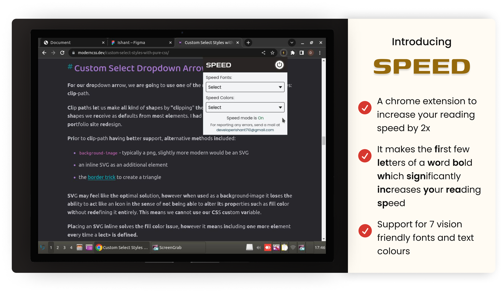
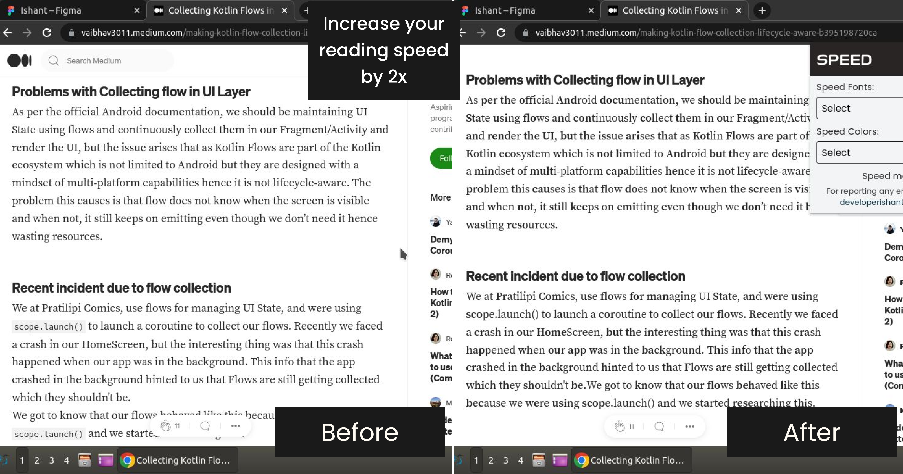
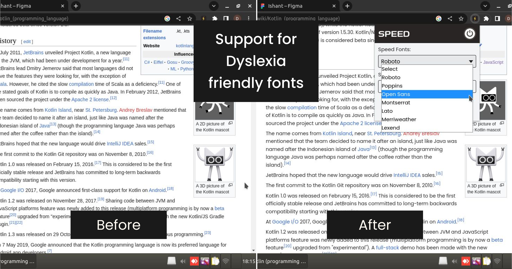
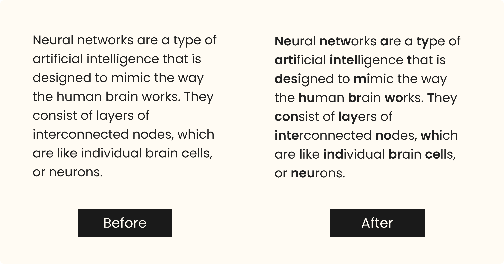

# Speed

Speed is a chrome extension that helps you read much faster! It makes first few letters of words on your web page bold which makes you read them much faster!

Here is a short video about this chrome extension: https://youtube.com/shorts/hkg-vCHtLc0

# Features

- Speed mode
- 7 fonts (including dyslexia friendly fonts) to improve reading experience
- 5 vision friendly text colors to reduce eye strain

# Working Principal

By making the beginning letters of a word bold, a person's brain can identify them with much less effort and concentration. This concept is known as Bionic Reading!

# Contact

For any queries, you can mail me at developerishant710@gmail.com

